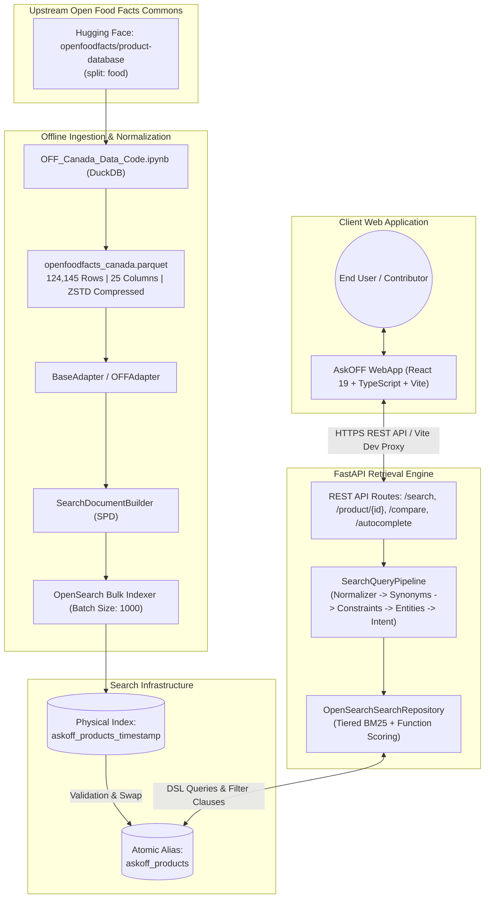
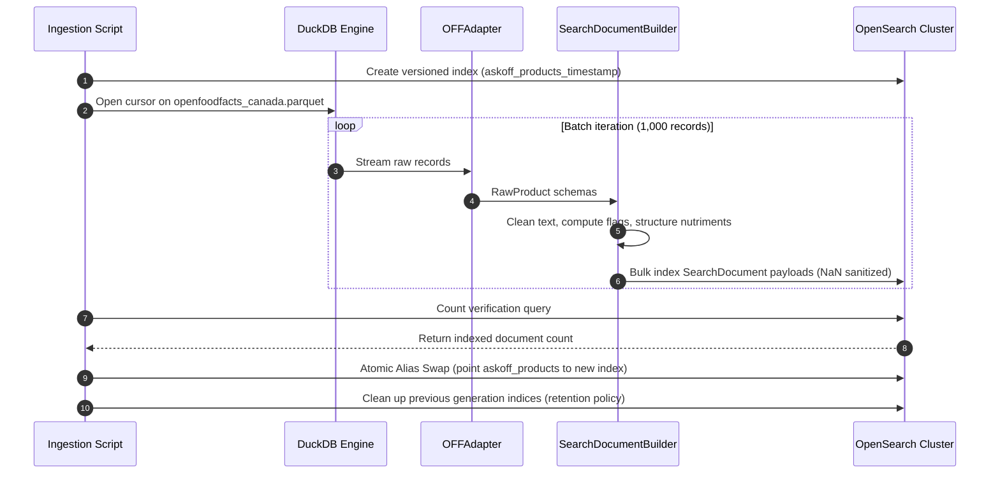
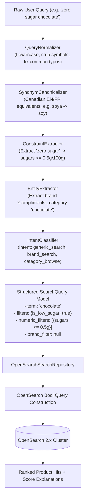

# System Architecture — AskOFF Canada & Open Food Facts

This document details the complete end-to-end system architecture of the AskOFF search and discovery platform developed during the Open Food Facts Software Development Engineer (SDE) Internship. It covers the offline data engineering lifecycle, the online natural language query processing pipeline, the client-side single-page application (SPA), container orchestration, and contributor repository boundaries.

---

## 1. End-to-End Architectural Overview

The system is engineered as two decoupled, independently scalable components:
1. **AskOFF Retrieval Backend (`offCanada/AskOFF-Search`)**: A Python 3.11+ service utilizing FastAPI, DuckDB, and OpenSearch 2.12+ to ingest, index, and query 124,145 Canadian Open Food Facts products.
2. **AskOFF WebApp (`offCanada/AskOFF-WebApp`)**: A React 19.2+ and TypeScript 6.0+ client application running on Vite 8.1+, providing responsive search, side-by-side food comparison, recipe ingredient lookup, and grounded product inquiry.



---

## 2. Architectural Diagrams (Evidence Assets)

The visual representations below represent the verified system and backend architectures implemented during the project.

### System Architecture Flow


*Figure 1: High-level architectural boundaries separating client browser execution, typed API communication, and the backend OpenSearch retrieval cluster.*

### Backend Query & Ingestion Pipelines


*Figure 2: Detailed view of the dual-pipeline architecture showing DuckDB batch ingestion on the right and FastAPI request orchestration on the left.*

---

## 3. Data Pipeline Subsystem

The data pipeline transitions raw, crowdsourced food records from global datasets into an indexed, query-optimized search index without incurring runtime analytical overhead.

### Data Flow Stages
1. **Source Filtering**: The upstream `openfoodfacts/product-database` dataset on Hugging Face contains millions of global food products. A streaming DuckDB query filters records where `list_contains(countries_tags, 'en:canada')`, isolating **124,145 Canadian products**.
2. **Schema Reduction**: 25 essential columns are extracted into a high-density Parquet file (`openfoodfacts_canada.parquet`, 21.8 MB compressed via ZSTD).
3. **Image URL Synthesis**: While image metadata exists in the `images` struct across all 124,145 records, direct CDN URLs are pre-synthesized during data generation for products with valid `front_en` metadata using the official format:
   $$\text{URL} = \text{https://images.openfoodfacts.org/images/products/} + \text{LPAD}(\text{code}, 13, \text{'0'}) + \text{'/'} + \text{imgid} + \text{'.jpg'}$$
   This yields **28,608 pre-computed direct image URLs** (23.044% coverage), with the remaining records dynamically resolved or fallback-rendered via client-side SVG placeholders.
4. **Adapter Ingestion Layer (`backend/adapters/`)**:
   - `BaseAdapter`: Abstract base class enforcing the contract for multi-source ingestion.
   - `OFFAdapter`: Memory-safe cursor streaming Parquet records using DuckDB chunking into Pydantic `RawProduct` instances.
   - `ComplimentsAdapter`: Specialized adapter for private label store-brand benchmark datasets (`compliments_products.parquet`).
   - `ReferenceAdapter`: Fixture adapter providing mock data for hermetic unit testing.
5. **SearchDocumentBuilder (Semantic Product Document - SPD)**:
   - Sanitizes text artifacts, normalizes barcode strings (preserving leading zeroes), and structures raw nutrition values into validated per-100g numbers.
   - Precomputes boolean dietary flags: `is_organic`, `is_vegan`, `is_vegetarian`, `is_palm_oil_free`, `is_high_protein` ($\ge 10.0\text{g}/100\text{g}$), `is_low_sugar` ($\le 5.0\text{g}/100\text{g}$), `is_gluten_free`, `is_low_sodium` ($\le 0.12\text{g}/100\text{g}$), and `is_lactose_free`.
6. **Blue/Green Index Lifecycle (`backend/search/indexer.py`)**:
   - Creates a physical versioned index: `askoff_products_YYYYMMDDHHMMSS`.
   - Ingests documents in batches of 1,000 using OpenSearch bulk helpers.
   - Verifies record count and document integrity before atomically swapping the `askoff_products` alias. Zero downtime and instant rollbacks.



---

## 4. Online Search & Query Understanding Pipeline

The online search pipeline executes in sub-50ms without invoking any large language models (LLMs) at runtime. Query interpretation is completely deterministic, transparent, and explainable.



### Query DSL Scoring Structure
The `OpenSearchSearchRepository` translates the structured query into an OpenSearch DSL payload with explicit clause separation:

1. **`must` Clauses**:
   - Boolean dietary flags (`is_organic`, `is_vegan`, etc.).
   - Numeric range filters (`attributes.nutrition.<nutrient>.per_100g` with `gte` / `lte` boundaries).
2. **`filter` Clauses**:
   - Hard brand isolation when an unambiguous store-brand entity is detected.
3. **`should` Clauses (Tiered Lexical Match)**:
   - **Tier 1: Exact Phrase Match** (Boost: `10.0`) across `product_name^3.0`, `brand^2.0`, `category^1.5`.
   - **Tier 2: Conjunction AND Match** (Boost: `5.0`) requiring all search tokens across fields.
   - **Tier 3: Fuzzy AUTO Match** (Boost: `0.5`) with Levenshtein distance 1–2 for typo tolerance.
4. **Function Score (Quality Weighting)**:
   - Enhances lexical BM25 scores with record completeness:
     $$\text{Final Score} = \text{BM25 Score} + (\text{metadata.completeness} \times 0.15)$$
5. **Directional Sorting**:
   - Queries requesting extreme nutritional values (e.g., "lowest sugar") apply explicit ascending/descending sorts on the target nutrient field prior to tie-breaking by BM25 score.

---

## 5. Frontend Client Architecture

The frontend application is structured as an accessible, performant single-page application built on React 19 and TypeScript:

```mermaid
flowchart TD
    subgraph Routes [React Router 7 Routes]
        R_Discover["/discover (LandingPage)"]
        R_Search["/search (SearchPage)"]
        R_Product["/product/:id (ProductDetailsPage)"]
        R_Compare["/compare (ComparePage)"]
        R_OffBot["/offbot (OffBotPage)"]
        R_Lists["/lists (ListsPage)"]
        R_Recipes["/recipes (RecipesPage)"]
        R_Extensions["/extensions (ExtensionsPage)"]
        R_Status["/status (DashboardPage)"]
        R_About["/about (AboutPage)"]
    end

    subgraph State_Management [State Architecture]
        TQ["TanStack Query Cache<br/>(stale-while-revalidate, request deduplication)"]
        CC["CompareContext (localStorage persistent, 2-4 products)"]
        LC["ListsContext (localStorage persistent, favorites & grocery)"]
        AC["AssistantContext (session conversation history & product focus)"]
    end

    subgraph Reusable_Components [Shared Presentation UI]
        Card["ProductCard (Nutri-Score, NOVA, macros)"]
        ImageLoader["ProductImage (4-tier CDN resolution)"]
        Bar["SearchBar (Debounced autocomplete, AbortSignal)"]
        Table["NutritionTable (per-100g regulatory standards)"]
        BotWidget["OffBotWidget (Floating Action Button & Drawer)"]
    end

    R_Discover & R_Search & R_Product & R_Compare --> TQ
    R_Compare --> CC
    R_Lists --> LC
    R_OffBot & BotWidget --> AC
    R_Search & R_Discover --> Bar
    R_Search & R_Compare --> Card
    Card & R_Product --> ImageLoader
    R_Product & R_Compare --> Table
```



### Key Architectural Patterns
- **Route-Level Code Splitting**: All 10 page routes are lazy-loaded via `React.lazy()` and wrapped in `Suspense` with accessible skeleton fallbacks, minimizing initial vendor bundle footprint.
- **Race-Condition-Free Autocomplete**: The `SearchBar` component manages an active `AbortController` instance. If a new keystroke occurs before a previous autocomplete request resolves, the in-flight request is immediately aborted.
- **Four-Tier CDN Image Resolution**: Food images on Open Food Facts can vary in CDN availability. The `ProductImage` component attempts:
  1. Direct precomputed `front_image_url`.
  2. Synthesized CDN URL from raw barcode and `images` struct metadata.
  3. High-resolution primary CDN endpoint (`/images/products/...`).
  4. Vector SVG fallback (`ProductImagePlaceholder.tsx`) conveying product category.
- **Persistent Client State**: User-curated comparison items and grocery bookmarks persist in browser `localStorage`, surviving browser restarts without requiring user accounts or database sessions.

---

## 6. Deployment & Runtime Infrastructure

```mermaid
flowchart LR
    subgraph Client_Environment [Client Device]
        Browser["Modern Web Browser"]
    end

    subgraph Reverse_Proxy [Reverse Proxy / Gateway]
        Proxy["Nginx / Caddy / Cloudflare<br/>(TLS Termination, gzip/brotli, Cache headers)"]
    end

    subgraph Application_Containers [Docker Compose Environment]
        Frontend_App["Vite Static Production Assets<br/>(Port 5173 dev / Nginx dist)"]
        Backend_API["FastAPI REST Backend<br/>(Uvicorn ASGI, Port 8000, Non-root)"]
        OS_Node["OpenSearch 2.12+ Container<br/>(Port 9200, Volume: opensearch-data)"]
    end

    Browser <-->|HTTPS (Port 443)| Proxy
    Proxy -->|/api/*| Backend_API
    Proxy -->|Static Chunks /*| Frontend_App
    Backend_API <-->|Internal Docker Network (9200)| OS_Node
```

### Security & Operational Hardening
- **CORS Origin Enforcement**: Wildcard origins (`*`) are disallowed when credentialed requests are active. Allowed origins are explicitly restricted via environment variables.
- **Container Hygiene**: Backend container images execute under an unprivileged user (`appuser`, UID 10001) rather than root.
- **Input Validation**: FastAPI routes validate query lengths ($\le 500$ chars), pagination bounds ($\text{size} \le 100$, $\text{offset} \le 10,000$), and comparison product limits ($\le 50$ IDs).
- **Sanitized Errors**: Database internals, stack traces, and OpenSearch query payloads are stripped before returning HTTP 500 error envelopes to the client.

---

## 7. Contributor Boundaries

The project architecture establishes clean organizational separation:

| Subsystem | Primary Repository | Contributor Responsibilities |
|---|---|---|
| **Frontend WebApp** | [`offCanada/AskOFF-WebApp`](https://github.com/offCanada/AskOFF-WebApp) | UI components, Tailwind styling, page layouts, client state, TypeScript types, accessibility-focused implementation, and Vitest component tests. |
| **Backend & Search** | [`offCanada/AskOFF-Search`](https://github.com/offCanada/AskOFF-Search) | Query parsing, constraint extraction, synonym dictionaries, OpenSearch mappings, adapter interfaces, index lifecycle, and pytest test suites. |
| **Dataset Engineering** | [`offCanada/openfoodfacts-canada`](https://huggingface.co/datasets/offCanada/openfoodfacts-canada) | DuckDB extraction pipelines, Parquet schema maintenance, image metadata verification, and reproducibility notebooks ([Hugging Face Notebook](https://huggingface.co/datasets/offCanada/openfoodfacts-canada/blob/main/OFF_Canada_Data_Code.ipynb) and [Kaggle Publication](https://www.kaggle.com/datasets/saitejakommi/open-food-facts-canada-dataset)). |
