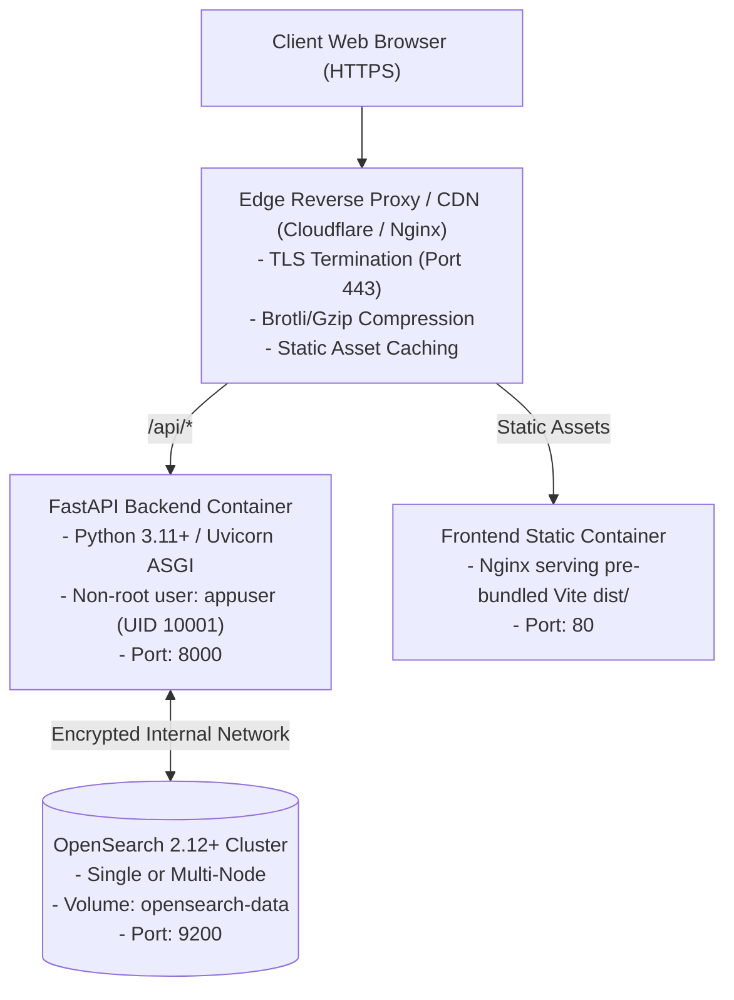

# Deployment & Infrastructure Guide — AskOFF Canada

This document details the container orchestration, runtime environments, configuration management, and deployment status of the AskOFF search platform.

---

## 1. Deployment State Matrix

To ensure absolute accuracy, the current deployment status of AskOFF is categorized below:

| Environment | Status | Verification & Description |
|---|---|---|
| **Local Development** | **VERIFIED / OPERATIONAL** | OpenSearch 2.12+ container running via Docker Compose, FastAPI Uvicorn server on port 8000, Vite frontend on port 5173 with `/api` proxy. |
| **Production Implementation** | **IMPLEMENTED / READY** | Fully containerized with production Dockerfile, non-root user execution (`appuser`), healthcheck probes, locked dependency trees, and Pydantic configuration validation. |
| **Public Production Deployment** | **PENDING MAINTAINER ACTION** | The service is not yet publicly hosted on a public domain. Production domain allocation and cloud infrastructure provisioning await scheduling and review by Open Food Facts core maintainers. |

---

## 2. Target Production Architecture

When provisioned on production infrastructure, the intended deployment architecture follows a standard reverse-proxy model:



---

## 3. Container Configuration & Hardening

### Multi-Stage Dockerfile (`Dockerfile`)
The backend Dockerfile uses a secure multi-stage build:
1. **Builder Stage**: Compiles and installs Python wheels into a virtual environment.
2. **Final Stage**: Copies only runtime dependencies into a minimal `python:3.11-slim` image.
3. **Non-Root Execution**: Creates and switches to an unprivileged service account:
   ```dockerfile
   RUN groupadd -g 10001 appuser && \
       useradd -u 10001 -g appuser -s /bin/bash -m appuser
   USER appuser
   ```
4. **Healthcheck Probe**: Includes a native container healthcheck polling `/health`:
   ```dockerfile
   HEALTHCHECK --interval=30s --timeout=5s --start-period=10s --retries=3 \
     CMD curl -f http://localhost:8000/health || exit 1
   ```

### Docker Compose Profiles

#### Local Development (`docker-compose.yml`)
Starts the OpenSearch cluster with security disabled for local development speed:
```yaml
services:
  opensearch:
    image: opensearchproject/opensearch:2.12.0
    environment:
      - discovery.type=single-node
      - plugins.security.disabled=true
      - "OPENSEARCH_JAVA_OPTS=-Xms512m -Xmx512m"
    ports:
      - "9200:9200"
    volumes:
      - opensearch-data:/usr/share/opensearch/data

volumes:
  opensearch-data:
```

#### Production Stack (`docker-compose.production.yml`)
Orchestrates OpenSearch, the ingestion batch job, and the FastAPI application behind an isolated bridge network with TLS and strict environment validation enabled.

---

## 4. Configuration Management (`Settings`)

Configuration is managed via Pydantic Settings (`backend/config/settings.py`), loading from environment variables with an `ASKOFF_` prefix or `.env` files:

| Environment Variable | Default Value | Production Requirement |
|---|---|---|
| `ASKOFF_OPENSEARCH_HOSTS` | `["localhost:9200"]` | Hostname and port of the production cluster. |
| `ASKOFF_OPENSEARCH_INDEX` | `"askoff_products"` | Active search alias pointing to the versioned index. |
| `ASKOFF_OPENSEARCH_USE_SSL`| `false` | Must be `true` in production environments. |
| `ASKOFF_OPENSEARCH_USERNAME` | `null` | Mandatory along with password in production. |
| `ASKOFF_OPENSEARCH_PASSWORD` | `null` | Mandatory along with username in production. |
| `ASKOFF_CORS_ORIGINS` | Localhost ports | Must list explicit production origins; wildcard `*` rejected. |
| `ASKOFF_ENVIRONMENT` | `"development"` | Set to `"production"` to activate strict validation guards. |
| `ASKOFF_API_DEBUG` | `false` | Must remain `false` in production. |

### Strict Production Guards
If `ASKOFF_ENVIRONMENT=production`, the application refuses to start if:
- `api_debug` is true.
- OpenSearch TLS or certificate verification is disabled.
- OpenSearch credentials are missing.
- CORS origins contain `*` or are empty.

---

## 5. Running the Stack Locally

### Option 1: Docker Compose (Full Stack)
```bash
# 1. Clone repository
git clone https://github.com/offCanada/AskOFF-Search.git
cd AskOFF-Search

# 2. Launch OpenSearch container
docker compose up -d opensearch

# 3. Ingest canonical 124,145 Canadian product catalog
python backend/scripts/verify_index.py

# 4. Start backend API
uvicorn backend.api.app:app --reload --port 8000
```

### Option 2: Launching Frontend WebApp
```bash
# 1. Clone repository
git clone https://github.com/offCanada/AskOFF-WebApp.git
cd AskOFF-WebApp

# 2. Install dependencies & configure API proxy
npm install
cp .env.example .env

# 3. Start development server
npm run dev
```
The application opens at `http://localhost:5173` with Vite proxying `/api` requests directly to `http://127.0.0.1:8000`.
