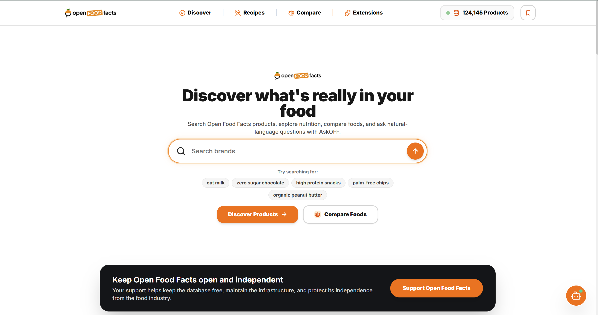

# Frontend Web Application — AskOFF WebApp

This document details the architecture, design system, component hierarchy, state management, and implementation of the AskOFF frontend web application (`offCanada/AskOFF-WebApp`).

---

## 1. Technology Stack & Build Pipeline

The frontend is engineered as a modern, accessible Single-Page Application (SPA) designed to provide instant response times across desktop and mobile devices.

| Layer / Library | Version | Engineering Role |
|---|---|---|
| **Core Framework** | React 19.2+ | Concurrent rendering, declarative component tree |
| **Language** | TypeScript 6.0+ | Strict type safety, interfaces matching backend Pydantic schemas |
| **Bundler & Build** | Vite 8.1+ | Sub-second Hot Module Replacement (HMR) and optimized Rollup bundling |
| **Data Fetching & Cache** | TanStack Query 5.101+ | Server-state caching, automatic request deduplication, background refetching |
| **Routing** | React Router 7.18+ | Declarative routing with route-level code splitting |
| **Styling** | TailwindCSS 3.4+ | Design system tokens, responsive breakpoints, accessible focus rings |
| **Icons & Visuals** | Lucide React 1.24+ | Accessible SVG iconography |
| **Test Runner** | Vitest 4.1+ | Unit and component behavior testing with JSDOM |

### Verified Build Metrics
The production build compiles with zero errors and minimal chunk sizes:
```text
> askoff-webapp@0.0.0 build
> tsc -b && vite build

vite v8.1.4 building client environment for production...
transforming...✓ 1863 modules transformed.
rendering chunks...
computing gzip size...
dist/index.html              0.62 kB │ gzip:  0.34 kB
dist/assets/index-D9z0oMeV.css 50.57 kB │ gzip:  9.48 kB
dist/assets/index-Cjc9Zr3H.js  266.00 kB │ gzip: 81.59 kB
✓ built in 4.45s
```

---

## 2. Application Pages & Route Architecture

All 10 routes are asynchronously loaded via `React.lazy()` and wrapped in an accessible `<Suspense>` boundary:

| Route Path | Page Component | Key Functionality & Features |
|---|---|---|
| `/` or `/discover` | `LandingPage.tsx` | Hero search, dynamic typewriter placeholders, popular query pills, category showcases, and mobile app attribution. |
| `/search` | `SearchPage.tsx` | Live search results grid, 9 dietary & health filter toggles, sort dropdown, responsive drawer, and pagination controls. |
| `/product/:id` | `ProductDetailsPage.tsx` | Comprehensive product sheet: 4-tier CDN image, Nutri-Score A–E, NOVA Group 1–4, Eco-Score, nutrition facts table per 100g, ingredients, allergens, and link to world.openfoodfacts.org. |
| `/compare` | `ComparePage.tsx` | Multi-product side-by-side matrix for 2 to 4 foods, calculating nutrient deltas (e.g. calories, sugar, protein) and highlighting advantages. |
| `/offbot` | `OffBotPage.tsx` | Dedicated conversational food discovery assistant with grounded citations to authentic Open Food Facts records. |
| `/lists` | `ListsPage.tsx` | Client-side persistent grocery list and favorite bookmarks with print and JSON export capabilities. |
| `/recipes` | `RecipesPage.tsx` | Recipe & ingredient discovery hub linking culinary ingredients directly to live Canadian barcode tokens. |
| `/extensions` | `ExtensionsPage.tsx` | Ecosystem showcase demonstrating planned community plugins, barcode scanning extensions, and external integrations. |
| `/status` | `DashboardPage.tsx` | Live service health check, OpenSearch connection status, total indexed products (124,145), and autocomplete testing sandbox. |
| `/about` | `AboutPage.tsx` | Open Food Facts mission, open commons attribution (ODbL), architecture pillars, and repository links. |

---

## 3. Visual Walkthrough & Evidence Assets

### 1. Landing & Discovery (`LandingPage.tsx`)
The landing interface provides a clean, welcoming search experience with quick suggestion chips and live catalog statistics.

*Figure 1: Landing page featuring search bar, quick query pills, and real-time catalog indicator.*

### 2. Search & Nutritional Filtering (`SearchPage.tsx`)
Searching for conversational queries such as `"zero sugar chocolate"` surfaces products that strictly satisfy Canadian regulatory thresholds ($0.0\text{g} \text{ sugar}$) with active filter toggles.

*Figure 2: Search interface displaying 344 matching zero-sugar chocolate items with Nutri-Score and nutrient badges.*

### 3. Product Details Sheet (`ProductDetailsPage.tsx`)
Detailed view displaying complete nutritional transparency, verified allergen warnings, official Nutri-Score, and NOVA food processing classifications.

*Figure 3: Product specifications for organic peanut butter, including barcode copy button and external Open Food Facts link.*

### 4. Side-by-Side Nutritional Comparison (`ComparePage.tsx`)
Allows consumers to select 2 to 4 products to evaluate differences in calories, saturated fat, sodium, and ingredients.

*Figure 4: Side-by-side comparison matrix highlighting nutritional advantages between two peanut butter products.*

### 5. Recipe & Ingredient Discovery Hub (`RecipesPage.tsx`)
Pairs curated whole-food recipes with Canadian Open Food Facts products. Clicking any ingredient triggers a targeted search.

*Figure 5: Recipes page demonstrating how culinary recipe lines map directly to live database query tokens.*

### 6. Grounded Food Assistant (`OffBotPage.tsx` & `OffBotWidget.tsx`)
Provides deterministic answers to dietary questions grounded strictly in indexed Open Food Facts records.

*Figure 6: OffBot conversation interface with suggested follow-up queries and verifiable citations.*

---

## 4. Reusable Presentation Component Design

The frontend organizes UI logic into 16 modular components under `src/components/`:

- **`ProductCard.tsx`**: Renders product image, title, brand, Nutri-Score badge, macro-nutrient pills, and quick action buttons (compare, bookmark).
- **`ProductImage.tsx`**: Manages resilient image rendering through a 4-tier fallback:
  1. Direct precomputed `front_image_url`.
  2. Synthesized CDN URL from barcode metadata.
  3. Official Open Food Facts image server path.
  4. Category-aware SVG placeholder (`ProductImagePlaceholder.tsx`).
- **`SearchBar.tsx`**: Search input featuring typewriter text animation, debounced autocomplete with `AbortController` cancellation, and keyboard traversal.
- **`NutritionTable.tsx`**: Structured nutritional facts table compliant with European and Health Canada per-100g labeling formats.
- **`NutriScoreBadge.tsx` & `NutriScoreLogo.tsx`**: Vector graphics displaying official Nutri-Score ratings (A through E) and NOVA food processing classes (1 through 4).
- **`FilterSidebar.tsx`**: Desktop sidebar and mobile slide-over drawer exposing toggles for Nutri-Score A & B, Organic, Vegan, Vegetarian, Palm-Oil Free, Gluten-Free, Lactose-Free, High Protein, Low Sugar, and Low Sodium.
- **`ErrorBoundary.tsx`**: Intercepts unhandled React rendering errors, displaying a user-friendly recovery interface rather than a blank screen.

---

## 5. Client State Management

The application separates server state from local client state cleanly:
1. **Server State (TanStack Query)**:
   - Queries to `/search`, `/product/:id`, `/autocomplete`, and `/compare` are managed by TanStack Query with a 5-minute stale time.
   - Duplicate concurrent requests for identical queries are automatically deduplicated.
2. **Comparison State (`CompareContext.tsx`)**:
   - Stores up to 4 selected product barcodes in browser `localStorage`.
   - Accessible from any page or product card, displaying an active count badge in the navigation header.
3. **Grocery & Saved Lists (`ListsContext.tsx`)**:
   - Stores favorited barcodes and user shopping lists in browser `localStorage`.
   - Includes client-side JSON export and print-friendly CSS formatting.
4. **Assistant State (`AssistantContext.tsx`)**:
   - Preserves multi-turn conversational dialogue and allows setting an active product focus when navigating from a product details page.

---

## 6. AskOFF Assistant (OffBot) Implementation

### Grounded Deterministic Architecture
The AskOFF Assistant (`src/api/assistantService.ts`) is designed to answer nutritional and comparative questions using **verifiable Open Food Facts data**:
- **Nutri-Score Explanations**: Calculates why a product received a given Nutri-Score grade based on energy, saturated fat, sugars, and sodium content.
- **Comparative Answers**: Compares active products against other items in the catalog (e.g., "Which peanut butter has the highest protein?").
- **ODbL Citations**: Every response includes structured citation metadata pointing directly to the official Open Food Facts record (`https://world.openfoodfacts.org/product/<barcode>`).
- **Zero Runtime LLM Dependency**: Operates entirely client-side and via deterministic backend search calls. Generative Small Language Model (SLM) and Retrieval-Augmented Generation (RAG) capabilities are designed as structured payloads for future expansion.

---

## 7. Accessibility-Focused Implementation & Quality

- **Keyboard Navigation**: All interactive elements (buttons, filter chips, cards, search inputs) maintain visible focus rings via Tailwind `:focus-visible` styles and standard `Tab` / `Enter` / `Space` traversal.
- **Semantic HTML**: Proper heading hierarchies (`<h1>` per page, sequential `<h2>` and `<h3>`), `<nav>`, `<main>`, `<article>`, and `<aside>` landmark elements.
- **Motion Accessibility**: Micro-animations and typewriter effects honor user `prefers-reduced-motion` settings.
- **Note on Accessibility Standards**: Accessibility features were implemented following WCAG 2.1 AA best practices in component code. No formal third-party accessibility audit was conducted.
