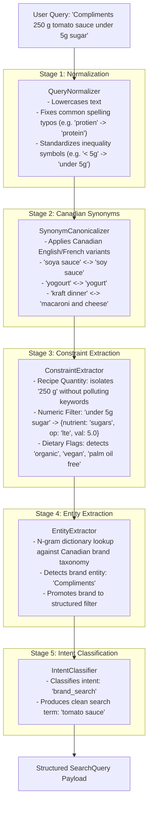

# Search Engine & Backend Infrastructure — AskOFF Canada

This document details the search engine architecture, query processing pipeline, OpenSearch index configuration, lexical scoring mechanics, and API design implemented in the AskOFF backend (`offCanada/AskOFF-Search`).

---

## 1. Architectural Philosophy: Deterministic Query Understanding

Traditional keyword search engines treat entire query strings as raw lexical tokens. When a consumer inputs:
> `"250 g tomato sauce under 5g sugar"`

A standard BM25 engine searches for documents containing `"250"`, `"g"`, `"tomato"`, `"sauce"`, `"under"`, `"5g"`, and `"sugar"`. This frequently matches products that declare 250 calories, list sugar as an ingredient, or feature unrelated numeric codes.

Conversely, integrating generative Large Language Models (LLMs) directly into the search loop introduces:
- Non-deterministic responses and potential nutritional hallucination.
- 500ms to 2000ms latency overhead.
- High operational API costs per query.
- Dependency on external third-party network services.

**AskOFF's Engineering Choice**:
AskOFF implements a **deterministic, rule-based query understanding pipeline** coupled with an **OpenSearch 2.12+ BM25 lexical retrieval cluster**. It interprets nutritional constraints, brands, and culinary measurements mathematically in sub-50ms without invoking any runtime LLM.

---

## 2. The Online Query Understanding Pipeline

Every incoming query to `GET /search` traverses a sequence of five deterministic stages:



### Supported Constraint Extraction Behaviors

| User Phrase | Extracted Clean Term | Applied Constraint / Filter |
|---|---|---|
| `"250 g tomato sauce"` | `tomato sauce` | Decouples `quantity: 250 g` from keyword matching. |
| `"zero sugar chocolate"` | `chocolate` | Enforces hard filter `sugars <= 0.5g / 100g` (Canadian standard). |
| `"low sugar cereal"` | `cereal` | Enforces boolean flag `is_low_sugar: true` (`sugars <= 5.0g / 100g`). |
| `"drinks under 300 calories"`| `drinks` | Enforces numeric filter `energy-kcal <= 300.0`. |
| `"snacks with at least 20g protein"` | `snacks` | Enforces numeric filter `proteins >= 20.0g / 100g`. |
| `"lowest sugar chocolate"` | `chocolate` | Directs OpenSearch to sort ascending by `sugars.per_100g`. |
| `"Compliments peanut butter"` | `peanut butter` | Detects brand entity, promoting to `{brand: Compliments}` filter. |
| `"vegan high protein snacks"`| `snacks` | Enforces `is_vegan: true` AND `is_high_protein: true`. |
| `"no palm oil peanut butter"` | `peanut butter` | Enforces `is_palm_oil_free: true`. |
| `"high protien bread"` | `bread` | Normalizes typo `protien` $\to$ `protein`, enforcing `is_high_protein`. |

---

## 3. Semantic Product Document (SPD) & Ingestion

During ingestion, heterogeneous Open Food Facts records are consolidated into canonical **Semantic Product Documents (SPD)** modeled in Pydantic (`SearchDocument`):

```python
class SearchDocument(BaseModel):
    id: str  # Barcode string preserved with leading zeroes
    product_name: str
    brand: Optional[str] = None
    category: Optional[str] = None
    ingredients: Optional[str] = None
    attributes: Dict[str, Any] = Field(default_factory=dict)
    metadata: Dict[str, Any] = Field(default_factory=dict)
    search_text: str
    semantic_document: str
```

### Precomputed Health & Dietary Flags
Flags are computed deterministically during ingestion and indexed as booleans:
- `is_organic`: Detected via category/ingredient tokens (`organic`, `bio`).
- `is_vegan`: Analyzed from taxonomy tags and ingredient flags.
- `is_vegetarian`: Verified vegetarian ingredients or vegan status.
- `is_palm_oil_free`: Explicit absence of palm oil ingredients.
- `is_high_protein`: Protein content $\ge 10.0\text{g} / 100\text{g}$.
- `is_low_sugar`: Total sugar content $\le 5.0\text{g} / 100\text{g}$.
- `is_low_sodium`: Sodium content $\le 0.12\text{g} / 100\text{g}$.
- `is_gluten_free`: Explicit gluten-free claims or ingredients.

### Benefits of the SPD Architecture
1. **Dataset Independence**: Downstream search logic queries standardized fields regardless of whether data originated from Open Food Facts, private-label store datasets, or third-party feeds.
2. **Deterministic Indexing**: Nutrition is uniformly structured in a validated `attributes.nutrition.<key>.per_100g` format, avoiding nested schema mismatches during range queries.
3. **Future Extensibility**: The `semantic_document` text block aggregates all titles, ingredients, and nutritional attributes into human-readable text, providing the foundation for future dense vector embedding experiments.

---

## 4. OpenSearch Lexical Scoring & Query Construction

The `OpenSearchSearchRepository` translates the structured query into an OpenSearch bool DSL query:

```json
{
  "query": {
    "function_score": {
      "query": {
        "bool": {
          "must": [
            { "term": { "attributes.flags.is_low_sugar": true } },
            { "range": { "attributes.nutrition.sugars.per_100g": { "lte": 0.5 } } }
          ],
          "filter": [
            { "term": { "brand.keyword": "Compliments" } }
          ],
          "should": [
            {
              "multi_match": {
                "query": "chocolate",
                "type": "phrase",
                "boost": 10.0,
                "fields": ["product_name^3.0", "brand^2.0", "category^1.5"]
              }
            },
            {
              "multi_match": {
                "query": "chocolate",
                "operator": "and",
                "boost": 5.0,
                "fields": ["product_name^2.0", "search_text^1.0"]
              }
            },
            {
              "multi_match": {
                "query": "chocolate",
                "fuzziness": "AUTO",
                "boost": 0.5,
                "fields": ["product_name", "search_text"]
              }
            }
          ]
        }
      },
      "functions": [
        {
          "field_value_factor": {
            "field": "metadata.completeness",
            "factor": 0.15,
            "missing": 0.0
          }
        }
      ],
      "score_mode": "sum",
      "boost_mode": "sum"
    }
  }
}
```

### Scoring Strategy
1. **Tiered Relevance**: Exact phrase matches in product titles dominate results ($10.0 \times 3.0 = 30.0$ potential base boost). If no exact phrase exists, full token conjunction (AND match) takes precedence over fuzzy variations.
2. **Quality Weighting**: Open Food Facts completeness ratio ($0.0 \to 1.0$) adds up to $0.15$ to the BM25 score, promoting verified, photo-backed, complete records over sparse entries.

---

## 5. Index Lifecycle & Blue/Green Alias Swap

To prevent data corruption during index rebuilding:
1. A new physical index is created with a UTC timestamp: `askoff_products_20260828012000`.
2. The index mapping enforces explicit field types: keyword fields for filters, float fields for per-100g nutrients, and custom analyzer mappings with edge-ngram autocomplete.
3. Documents stream from the adapter in batches of 1,000 using bulk indexing helpers.
4. Once completed, document count and cluster health are validated.
5. The alias `askoff_products` is atomically swapped to point to the new physical index in a single operation:
   ```json
   {
     "actions": [
       { "remove": { "index": "*", "alias": "askoff_products" } },
       { "add": { "index": "askoff_products_20260828012000", "alias": "askoff_products" } }
     ]
   }
   ```
6. Older indices are pruned in accordance with the retention policy. The live search API never encounters an incomplete or rebuilding index.

---

## 6. REST API Endpoints

The FastAPI application provides typed, documented endpoints conforming to OpenAPI standards:

| Endpoint | Method | Purpose | Key Parameters |
|---|---|---|---|
| `/search` | `GET` | Natural language food search with query explainability | `q` (query string), `size` (1–100), `from_` (offset), `explain` (bool) |
| `/product/{id}` | `GET` | Exact product retrieval by barcode | `id` (barcode string) |
| `/autocomplete` | `GET` | Low-latency edge-ngram prefix search | `q` (prefix), `size` (default 5) |
| `/compare` | `POST` | Multi-product nutritional comparison matrix | JSON payload: `{"product_ids": ["...", "..."]}` |
| `/health` | `GET` | Service liveness health check | None |
| `/ready` | `GET` | Cluster readiness and OpenSearch alias verification | None |

### Operational Performance
- **Live Search Latency**: Typical query execution time on the live OpenSearch cluster is **sub-50ms**.
- **Input Bounds**: Enforces maximum query length of 500 characters, maximum page size of 100, and maximum compare ID count of 50.
